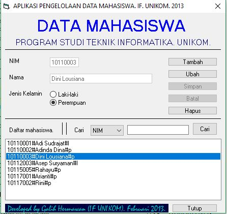

DESKRIPSI

Program untuk mengelola data berbasis flatfiles.
Contoh data adalah data mahasiswa, mencakup: nim, nama, dan jenis kelamin.

FITUR
1. Tambah data
2. Ubah data
3. Hapus data
4. Cari data (pencarian tepat berdasarkan data nim dan pencarian banyak data berdasarkan data nama)

CREATOR

Galih Hermawan (https://galih.eu).
Mail: galih.hermawan[at]gmail.com.

